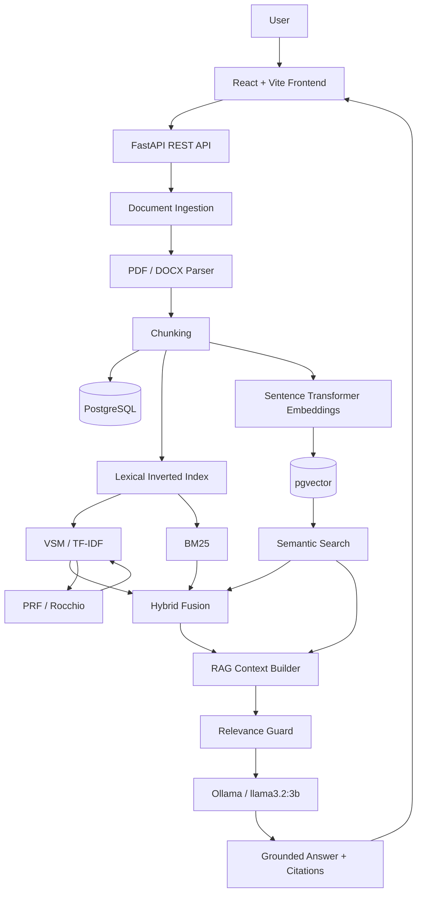

# MIR Search Engine

A full-stack academic information retrieval system that compares classical lexical retrieval, probabilistic ranking, dense semantic retrieval, hybrid fusion, pseudo relevance feedback, and grounded Retrieval-Augmented Generation (RAG) over a shared document corpus.

## Student Information

| Field | Value |
|---|---|
| Student | Ayla Nasiri |
| Student ID | 402150071 |
| Major | Computer Engineering |
| Course | Advanced Information Retrieval |
| University | Sharif International University of Technology |

---

## Project Overview

MIR Search Engine is a document search and question-answering application built for an Advanced Information Retrieval project.

The system supports:

- PDF document ingestion
- DOCX document ingestion
- Text extraction and chunking
- PostgreSQL document and chunk storage
- Lexical inverted index
- TF-IDF / Vector Space Model (VSM)
- Inexact Top-K optimization using Index Elimination
- BM25 ranking
- Dense semantic embeddings
- PostgreSQL + pgvector vector storage
- Semantic similarity search
- Hybrid lexical + semantic retrieval
- Pseudo Relevance Feedback (PRF) using the Rocchio method
- Retrieval-Augmented Generation (RAG)
- Inline source citations
- RAG relevance / insufficient-context guard
- Query-term highlighting for lexical results
- Document upload, re-index, inspection, and deletion
- React administration dashboard
- Responsive search interface

---

## Architecture



---

## Technology Stack

### Backend

- Python
- FastAPI
- SQLAlchemy
- Alembic
- PostgreSQL
- pgvector
- psycopg
- PyMuPDF
- python-docx
- sentence-transformers
- NumPy / SciPy / scikit-learn
- httpx
- pytest

### Frontend

- React 19
- Vite 8
- React Router
- Axios
- Tailwind CSS 4
- ESLint

### RAG / Local AI

- Ollama
- `llama3.2:3b`
- `sentence-transformers/all-MiniLM-L6-v2`
- Embedding dimension: `384`

---

## Retrieval Methods

### 1. VSM / TF-IDF

The Vector Space Model represents queries and documents using TF-IDF weighted term vectors.

Documents are ranked using cosine similarity between the query vector and document/chunk vectors.

The implementation also includes an Inexact Top-K optimization based on **Index Elimination**. High-IDF query terms are used to reduce the candidate set before full scoring.

### 2. BM25

BM25 provides probabilistic lexical ranking using:

- term frequency
- inverse document frequency
- document length normalization

It is useful for exact terminology, identifiers, and keyword-heavy queries.

### 3. Semantic Search

Each searchable chunk is embedded using:

```text
sentence-transformers/all-MiniLM-L6-v2
```

Each vector has:

```text
384 dimensions
```

Vectors are stored in PostgreSQL with the `pgvector` extension.

Incoming queries are embedded with the same model and compared to document vectors using vector similarity.

### 4. Hybrid Search

Hybrid retrieval combines lexical evidence with semantic evidence.

This allows:

- exact keyword matches to remain important
- semantically related documents to surface even when wording differs

### 5. Pseudo Relevance Feedback

The VSM pipeline supports Pseudo Relevance Feedback using the Rocchio method.

Process:

1. Execute the initial VSM search.
2. Treat the top retrieved chunks as pseudo-relevant documents.
3. Build a TF-IDF centroid from those chunks.
4. Select expansion terms.
5. Expand the original query.
6. Execute a second VSM retrieval.

The frontend displays:

- original query
- expanded query
- expansion terms
- PRF application status

### 6. Retrieval-Augmented Generation

RAG uses retrieved chunks as the only evidence for answer generation.

The system:

1. retrieves relevant chunks
2. builds an evidence context
3. checks whether the retrieved context is sufficiently relevant
4. sends the grounded context to the local LLM
5. returns an answer with inline citations such as:

```text
384 dimensions. [Source 1]
```

If the corpus does not contain sufficient information, the system returns:

```text
I could not find enough information in the provided documents.
```

instead of inventing an answer.

---

## Document Processing Pipeline

```text
Upload
  ↓
File validation
  ↓
File storage
  ↓
PDF / DOCX text extraction
  ↓
Chunking
  ↓
Lexical index creation
  ↓
Embedding generation
  ↓
pgvector storage
  ↓
Indexed status
  ↓
Search / RAG
```

Default chunk configuration:

```text
Chunk size:     500 words
Chunk overlap:   50 words
```

---

## Project Structure

```text
mir-rag-search-engine/
│
├── backend/
│   ├── app/
│   │   ├── api/
│   │   │   └── routes/
│   │   │       ├── documents.py
│   │   │       ├── health.py
│   │   │       ├── rag.py
│   │   │       └── search.py
│   │   │
│   │   ├── core/
│   │   │   └── config.py
│   │   │
│   │   ├── db/
│   │   │   └── database.py
│   │   │
│   │   ├── models/
│   │   ├── retrieval/
│   │   │   ├── bm25.py
│   │   │   ├── hybrid.py
│   │   │   ├── inverted_index.py
│   │   │   ├── prf.py
│   │   │   ├── semantic.py
│   │   │   ├── tokenizer.py
│   │   │   └── vsm.py
│   │   │
│   │   ├── schemas/
│   │   ├── services/
│   │   │   ├── chunk_service.py
│   │   │   ├── embedding_service.py
│   │   │   ├── generation_service.py
│   │   │   ├── indexing_service.py
│   │   │   ├── parser_service.py
│   │   │   ├── rag_context_service.py
│   │   │   ├── rag_guard_service.py
│   │   │   ├── rag_prompt_service.py
│   │   │   └── rag_service.py
│   │   │
│   │   └── main.py
│   │
│   ├── migrations/
│   ├── scripts/
│   ├── storage/
│   │   └── uploads/
│   ├── tests/
│   ├── .env.example
│   ├── alembic.ini
│   ├── pytest.ini
│   └── requirements.txt
│
├── frontend/
│   ├── public/
│   ├── src/
│   │   ├── api/
│   │   ├── components/
│   │   │   ├── admin/
│   │   │   └── search/
│   │   ├── layouts/
│   │   ├── pages/
│   │   │   ├── Dashboard.jsx
│   │   │   └── Search.jsx
│   │   ├── App.jsx
│   │   ├── index.css
│   │   └── main.jsx
│   │
│   ├── package.json
│   └── vite.config.js
│
├── .gitignore
└── README.md
```

---

## Prerequisites

Install the following before running the project:

- Python 3.11+ recommended
- Node.js
- npm
- PostgreSQL
- pgvector PostgreSQL extension
- Ollama

---

# Backend Setup

## 1. Open the Backend Directory

```powershell
cd backend
```

## 2. Create a Virtual Environment

```powershell
python -m venv .venv
```

Activate it:

```powershell
.\.venv\Scripts\Activate.ps1
```

## 3. Install Dependencies

```powershell
python -m pip install --upgrade pip
pip install -r requirements.txt
```

---

## 4. Configure PostgreSQL

Create a PostgreSQL database for the project.

Example:

```sql
CREATE DATABASE mir_search_engine;
```

Connect to the database and enable pgvector:

```sql
CREATE EXTENSION IF NOT EXISTS vector;
```

---

## 5. Configure Environment Variables

Copy:

```text
backend/.env.example
```

to:

```text
backend/.env
```

Example:

```env
DB_HOST=localhost
DB_PORT=5432
DB_NAME=mir_search_engine
DB_USER=postgres
DB_PASSWORD=your_password
```

The real `.env` file must not be committed to Git.

---

## 6. Run Database Migrations

From the `backend` directory:

```powershell
alembic upgrade head
```

---

## 7. Prepare Ollama

Make sure Ollama is installed and running.

Pull the model:

```powershell
ollama pull llama3.2:3b
```

Verify:

```powershell
ollama list
```

The application uses a local Ollama model for grounded answer generation.

---

## 8. Start the Backend

```powershell
python -m uvicorn app.main:app --reload
```

Backend:

```text
http://127.0.0.1:8000
```

FastAPI documentation:

```text
http://127.0.0.1:8000/docs
```

API prefix:

```text
/api/v1
```

---

# Frontend Setup

Open a second terminal.

```powershell
cd frontend
```

Install dependencies:

```powershell
npm install
```

Run development server:

```powershell
npm run dev
```

Frontend:

```text
http://localhost:5173
```

---

## Application Pages

### Search

```text
/
```

The Search page allows the user to choose between:

- VSM
- BM25
- Semantic Search
- Hybrid Search
- Ask AI / RAG

VSM also exposes the optional PRF toggle.

### Admin Dashboard

```text
/dashboard
```

The dashboard supports:

- upload PDF / DOCX
- process and index documents
- re-index documents
- inspect document metadata
- inspect chunks
- verify embedding readiness
- delete documents and indexed data

---

## Testing

### Backend

Activate the backend environment and run:

```powershell
python -m pytest -q
```

Final project verification:

```text
10 passed
```

### Frontend Lint

```powershell
npm run lint
```

### Frontend Production Build

```powershell
npm run build
```

---

## Acceptance Tests

The final project was manually validated for the following workflows:

| Feature | Status |
|---|---|
| PDF parsing | ✅ |
| DOCX parsing | ✅ |
| Chunking | ✅ |
| Inverted index | ✅ |
| VSM / TF-IDF | ✅ |
| Index Elimination / Inexact Top-K | ✅ |
| BM25 | ✅ |
| Embeddings | ✅ |
| pgvector storage | ✅ |
| Semantic Search | ✅ |
| Hybrid Search | ✅ |
| PRF / Rocchio | ✅ |
| Query highlighting | ✅ |
| RAG | ✅ |
| Inline citations | ✅ |
| Relevance guard | ✅ |
| Upload | ✅ |
| Document Details | ✅ |
| Re-index without duplicate chunks | ✅ |
| Delete from corpus | ✅ |
| Delete from search index | ✅ |
| Frontend lint | ✅ |
| Frontend build | ✅ |
| Backend test suite | ✅ |

---

## Example Evaluation Queries

### Exact Lexical Retrieval

```text
VECTOR-ALPHA-731
```

Useful for validating VSM and BM25.

### Semantic Retrieval

```text
How are dense vectors stored in PostgreSQL?
```

Useful for validating embedding-based retrieval.

### Hybrid Search

```text
What is hybrid search?
```

Useful for validating lexical + semantic fusion.

### PRF

```text
semantic retrieval
```

Enable Pseudo Relevance Feedback and verify that the expanded query differs from the original query.

### Positive RAG Test

```text
How many dimensions are used in this test?
```

Expected grounded answer:

```text
384 dimensions. [Source 1]
```

### Negative RAG Test

```text
What is the population of Mars?
```

Expected behavior:

```text
I could not find enough information in the provided documents.
```

---

## Re-index Behavior

Re-indexing replaces stale indexed data rather than appending duplicate chunks.

During final verification, a document with:

```text
2 chunks
2 embeddings
```

still contained:

```text
2 chunks
2 embeddings
```

after re-indexing.

---

## Delete Behavior

Deleting a document removes it from the corpus and its searchable indexed data.

This was validated by:

1. searching for a unique identifier
2. confirming the document was retrieved
3. deleting the document
4. searching for the same identifier again
5. confirming that no result was returned

---

## Security Notes

The repository must not contain:

- database passwords
- `.env`
- local virtual environments
- `node_modules`
- generated build files
- uploaded runtime documents

Use `.env.example` to document required environment variables.

---

## Academic Purpose

This project was created as an academic implementation of modern Information Retrieval concepts, combining classical retrieval techniques with neural semantic search and grounded RAG.

The focus is not only on answer generation, but on exposing and comparing the retrieval behavior behind the generated answer.

---

## Author

**Ayla Nasiri**  
Student ID: **402150071**  
Computer Engineering  
Advanced Information Retrieval  
Sharif International University of Technology
