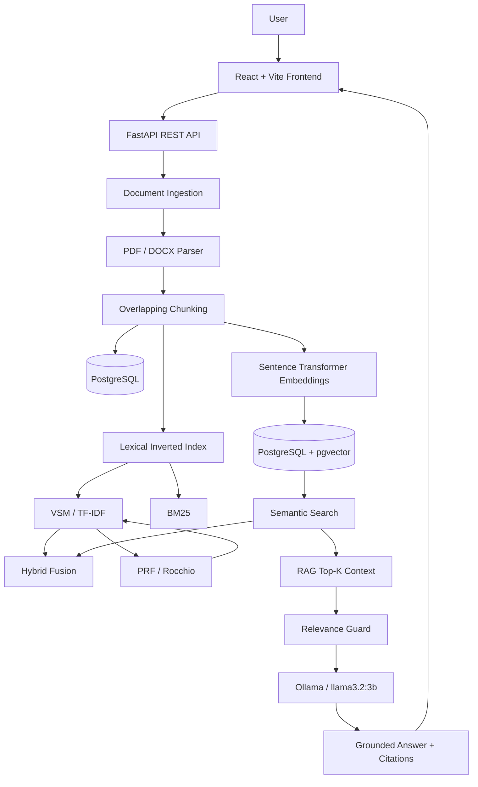

# MIR Search Engine

A full-stack academic Information Retrieval system that compares classical lexical retrieval, probabilistic ranking, dense semantic retrieval, hybrid fusion, Pseudo Relevance Feedback, and grounded Retrieval-Augmented Generation (RAG) over a shared document corpus.

Repository: https://github.com/AylaNasiri/mir-rag-search-engine

## Student Information

| Field | Value |
|---|---|
| Student | Ayla Nasiri |
| Student ID | 402150071 |
| Major | Computer Engineering |
| Course | Advanced Information Retrieval |
| University | Sharif International University of Technology |

---

## Project Overview

MIR Search Engine is a document search and question-answering application built for an Advanced Information Retrieval project.

The system supports:

- Native PDF document ingestion
- Native DOCX document ingestion
- Text extraction and overlapping chunking
- PostgreSQL document and chunk storage
- Classical lexical inverted index
- TF-IDF / Vector Space Model (VSM)
- Inexact Top-K optimization using Index Elimination
- User-configurable Top-K retrieval depth
- Okapi BM25 ranking
- Dense semantic embeddings
- PostgreSQL + pgvector vector storage
- Semantic similarity search
- Hybrid lexical + semantic retrieval
- Pseudo Relevance Feedback (PRF) using the Rocchio method
- Retrieval-Augmented Generation (RAG)
- User-configurable RAG context Top-K
- Inline source citations
- RAG relevance / insufficient-context guard
- Query-term highlighting for lexical results
- Document upload, processing, re-indexing, inspection, and deletion
- Synchronized lexical and vector index cleanup
- React administration dashboard
- Responsive search interface

---

## Architecture



---

## Technology Stack

### Backend
- Python
- FastAPI
- SQLAlchemy
- Alembic
- PostgreSQL
- pgvector
- psycopg
- PyMuPDF
- python-docx
- sentence-transformers
- NumPy / SciPy / scikit-learn
- httpx
- pytest

### Frontend
- React 19
- Vite 8
- React Router
- Axios
- Tailwind CSS 4
- ESLint

### RAG / Local AI
- Ollama
- `llama3.2:3b`
- `sentence-transformers/all-MiniLM-L6-v2`
- Embedding dimension: `384`

No external paid LLM API key is required because answer generation runs through a local Ollama model.

---

## Retrieval Methods

### 1. VSM / TF-IDF

The Vector Space Model represents queries and documents using TF-IDF weighted term vectors. Documents are ranked using cosine similarity.

The implementation includes **Inexact Top-K retrieval using Index Elimination**. High-IDF query terms reduce the candidate set before full TF-IDF cosine scoring.

This optimization is different from the user-selected result count:

- **Top-K Results** controls how many ranked results are returned to the interface.
- **Index Elimination** reduces how many candidate documents require full scoring.

For VSM, BM25, Semantic, and Hybrid search, the frontend provides:

```text
Top-K = 5 | 10 | 15 | 20
Default = 10
```

### 2. BM25

The project implements Okapi BM25 probabilistic lexical ranking using term frequency, inverse document frequency, and document length normalization.

### 3. Semantic Search

Each searchable chunk is embedded using:

```text
sentence-transformers/all-MiniLM-L6-v2
```

Each vector has:

```text
384 dimensions
```

Vectors are stored in PostgreSQL using the `pgvector` extension.

### 4. Hybrid Search

Hybrid retrieval combines lexical and semantic evidence so exact matches remain important while semantically related documents can still surface.

### 5. Pseudo Relevance Feedback

The VSM pipeline supports Pseudo Relevance Feedback using the Rocchio method:

1. Run the initial VSM search.
2. Treat the top retrieved chunks as pseudo-relevant.
3. Build a TF-IDF centroid.
4. Select expansion terms.
5. Expand the query.
6. Run a second VSM retrieval.

The frontend displays the original query, expanded query, expansion terms, and PRF status.

### 6. Retrieval-Augmented Generation

RAG uses dense semantic retrieval to obtain evidence chunks before generation.

The system:

1. embeds the user query
2. retrieves the Top-K semantically relevant chunks
3. builds a grounded evidence context
4. checks whether the context is sufficiently relevant
5. sends the context to the local Ollama LLM
6. returns an answer with inline source citations

The frontend exposes:

```text
RAG Context Top-K = 3 | 5 | 7
Default = 3
```

Example grounded answer:

```text
384 dimensions. [Source 1]
```

If the corpus does not contain sufficient information:

```text
I could not find enough information in the provided documents.
```

---

## Document Processing and Synchronization

```text
Upload
  ↓
File validation
  ↓
File storage
  ↓
PDF / DOCX text extraction
  ↓
Overlapping chunking
  ↓
Lexical index creation
  ↓
Embedding generation
  ↓
pgvector storage
  ↓
Indexed status
  ↓
Search / RAG
```

Default chunk configuration:

```text
Chunk size:     500 words
Chunk overlap:   50 words
```

When a document is deleted, its document data, chunks, lexical index data, and vector data are removed so the content no longer appears in search results.

Re-indexing replaces stale indexed data instead of appending duplicate chunks.

---

## Project Structure

```text
mir-rag-search-engine/
│
├── backend/
│   ├── app/
│   │   ├── api/
│   │   │   └── routes/
│   │   │       ├── documents.py
│   │   │       ├── health.py
│   │   │       ├── rag.py
│   │   │       └── search.py
│   │   ├── core/
│   │   ├── db/
│   │   ├── models/
│   │   ├── retrieval/
│   │   │   ├── bm25.py
│   │   │   ├── hybrid.py
│   │   │   ├── inverted_index.py
│   │   │   ├── prf.py
│   │   │   ├── semantic.py
│   │   │   ├── tokenizer.py
│   │   │   └── vsm.py
│   │   ├── schemas/
│   │   ├── services/
│   │   └── main.py
│   ├── migrations/
│   ├── scripts/
│   ├── storage/
│   ├── tests/
│   ├── .env.example
│   ├── alembic.ini
│   ├── pytest.ini
│   └── requirements.txt
│
├── frontend/
│   ├── public/
│   ├── src/
│   │   ├── api/
│   │   ├── components/
│   │   ├── layouts/
│   │   ├── pages/
│   │   │   ├── Dashboard.jsx
│   │   │   └── Search.jsx
│   │   ├── App.jsx
│   │   ├── index.css
│   │   └── main.jsx
│   ├── package.json
│   └── vite.config.js
│
├── .gitignore
└── README.md
```

---

## Prerequisites

- Python 3.11+ recommended
- Node.js
- npm
- PostgreSQL
- pgvector PostgreSQL extension
- Ollama
- Git

---

# Installation and Setup

## 1. Clone the Repository

```powershell
git clone https://github.com/AylaNasiri/mir-rag-search-engine.git
cd mir-rag-search-engine
```

## 2. Backend Setup

```powershell
cd backend
python -m venv .venv
.\.venv\Scripts\Activate.ps1
python -m pip install --upgrade pip
pip install -r requirements.txt
```

All backend commands should be run from the `backend` directory because the application loads its `.env` configuration from there.

## 3. PostgreSQL Setup

Create the database:

```sql
CREATE DATABASE mir_search_engine;
```

Connect to it and enable pgvector:

```sql
CREATE EXTENSION IF NOT EXISTS vector;
```

## 4. Environment Variables

From the `backend` directory:

```powershell
Copy-Item .env.example .env
```

Edit `.env`:

```env
DB_HOST=localhost
DB_PORT=5432
DB_NAME=mir_search_engine
DB_USER=postgres
DB_PASSWORD=your_password
```

Never commit the real `.env` file.

## 5. Database Migrations

```powershell
alembic upgrade head
```

## 6. Ollama

Pull the model:

```powershell
ollama pull llama3.2:3b
```

If Ollama is not already running as a service:

```powershell
ollama serve
```

Verify:

```powershell
ollama list
```

No external LLM API key is required.

## 7. Start the Backend

```powershell
python -m uvicorn app.main:app --reload
```

Backend:

```text
http://127.0.0.1:8000
```

FastAPI docs:

```text
http://127.0.0.1:8000/docs
```

API prefix:

```text
/api/v1
```

---

# Frontend Setup

Open a second terminal from the repository root:

```powershell
cd frontend
npm install
npm run dev
```

Frontend:

```text
http://localhost:5173
```

---

## Application Pages

### Search

Route:

```text
/
```

Available strategies:

- VSM
- BM25
- Semantic
- Hybrid
- Ask AI / RAG

For VSM, BM25, Semantic, and Hybrid:

```text
Top-K = 5, 10, 15, or 20
```

When VSM is selected, the interface also identifies:

```text
Inexact Top-K Optimization: Index Elimination
```

VSM additionally exposes the PRF toggle.

For Ask AI / RAG:

```text
RAG Context Top-K = 3, 5, or 7
```

### Admin Dashboard

Route:

```text
/dashboard
```

Supports:

- upload PDF / DOCX
- process and index documents
- re-index documents
- inspect document metadata
- inspect chunks
- verify embedding readiness
- delete documents and synchronized indexed data

---

## Testing

### Backend

From `backend` with the virtual environment active:

```powershell
python -m pytest -q
```

Final verified result:

```text
10 passed
```

### Frontend

From `frontend`:

```powershell
npm run lint
npm run build
```

---

## Acceptance Tests

| Feature | Status |
|---|---|
| PDF parsing | ✅ |
| DOCX parsing | ✅ |
| Overlapping chunking | ✅ |
| PostgreSQL storage | ✅ |
| Inverted index | ✅ |
| VSM / TF-IDF | ✅ |
| Index Elimination / Inexact Top-K | ✅ |
| User-configurable Search Top-K | ✅ |
| BM25 | ✅ |
| 384-dimensional embeddings | ✅ |
| pgvector storage | ✅ |
| Semantic Search | ✅ |
| Hybrid Search | ✅ |
| PRF / Rocchio | ✅ |
| Query highlighting | ✅ |
| RAG | ✅ |
| User-configurable RAG Context Top-K | ✅ |
| Inline citations | ✅ |
| Relevance guard | ✅ |
| Upload | ✅ |
| Document Details | ✅ |
| Re-index without duplicate chunks | ✅ |
| Delete from corpus | ✅ |
| Delete from search index | ✅ |
| Frontend lint | ✅ |
| Frontend build | ✅ |
| Backend test suite | ✅ |

---

## Example Evaluation Queries

### Exact Lexical Retrieval

```text
VECTOR-ALPHA-731
```

### Semantic Retrieval

```text
How are dense vectors stored in PostgreSQL?
```

### Hybrid Search

```text
What is hybrid search?
```

### PRF

```text
semantic retrieval
```

### Positive RAG Test

```text
How many dimensions are used in this test?
```

Expected:

```text
384 dimensions. [Source 1]
```

### Negative RAG Test

```text
What is the population of Mars?
```

Expected:

```text
I could not find enough information in the provided documents.
```

---

## Top-K Verification

### Search Top-K

VSM, BM25, Semantic, and Hybrid support:

```text
K = 5, 10, 15, 20
```

Selecting `K = 5` limits the interface to a maximum of five ranked retrieval results.

### VSM Inexact Top-K

VSM performs Index Elimination before final scoring:

```text
Query
  ↓
High-IDF query terms
  ↓
Reduced candidate set
  ↓
TF-IDF cosine scoring
  ↓
Top-K ranked results
```

This demonstrates that **Inexact Top-K optimization** and **user-selected result depth** are separate concepts.

### RAG Context Top-K

Ask AI / RAG supports:

```text
K = 3, 5, 7
```

Selecting `RAG Context Top-K = 3` retrieves at most three evidence chunks for the grounded generation context.

---

## Re-index Behavior

Re-indexing replaces stale indexed data rather than appending duplicate chunks.

A verified test document with:

```text
2 chunks
2 embeddings
```

still contained:

```text
2 chunks
2 embeddings
```

after re-indexing.

---

## Delete Behavior

Deletion was validated by:

1. searching for a unique identifier
2. confirming the document was retrieved
3. deleting the document
4. searching for the same identifier again
5. confirming that no result was returned

---

## Video Demonstration Checklist

The final 5-7 minute demonstration should show:

1. Upload a new PDF or DOCX.
2. Process/index it.
3. Query content from the uploaded document.
4. Delete the document.
5. Run the same query again and prove the document no longer appears.
6. Run an identical query through VSM, BM25, and Ask AI / RAG.
7. Show configurable Top-K.
8. Show VSM Index Elimination.
9. Show PRF query expansion.
10. Show a grounded RAG answer with citations.

---

## Security Notes

The repository must not contain:

- database passwords
- `.env`
- local virtual environments
- `node_modules`
- generated build files
- uploaded runtime documents

Use `.env.example` to document required environment variables.

---

## Academic Purpose

This project was created as an academic implementation of modern Information Retrieval concepts, combining classical retrieval techniques with neural semantic search and grounded RAG.

The focus is not only on answer generation, but also on exposing and comparing the retrieval behavior behind the generated answer.

---

## Author

**Ayla Nasiri**  
Student ID: **402150071**  
Computer Engineering  
Advanced Information Retrieval  
Sharif International University of Technology
